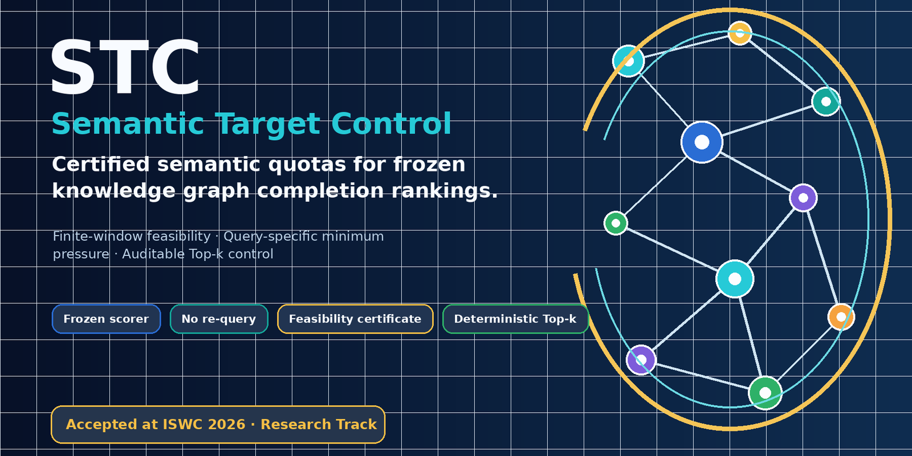
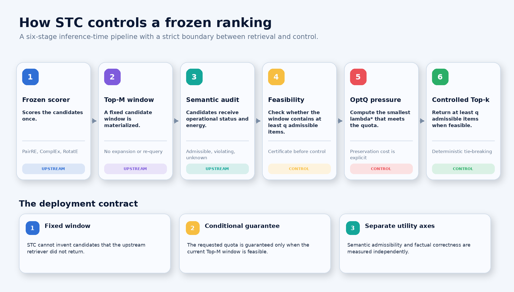
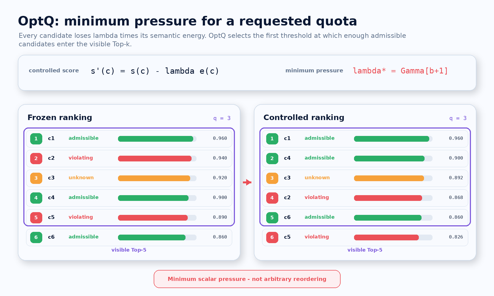
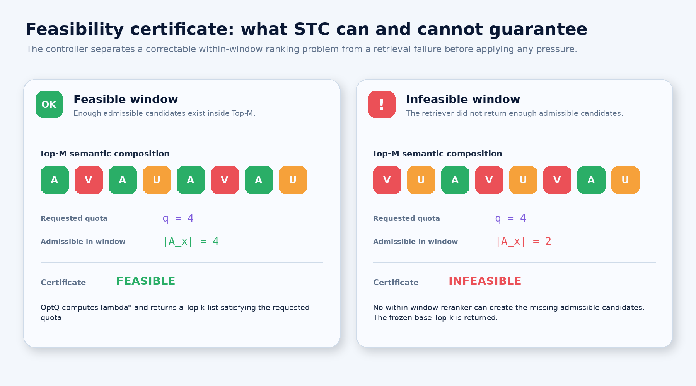
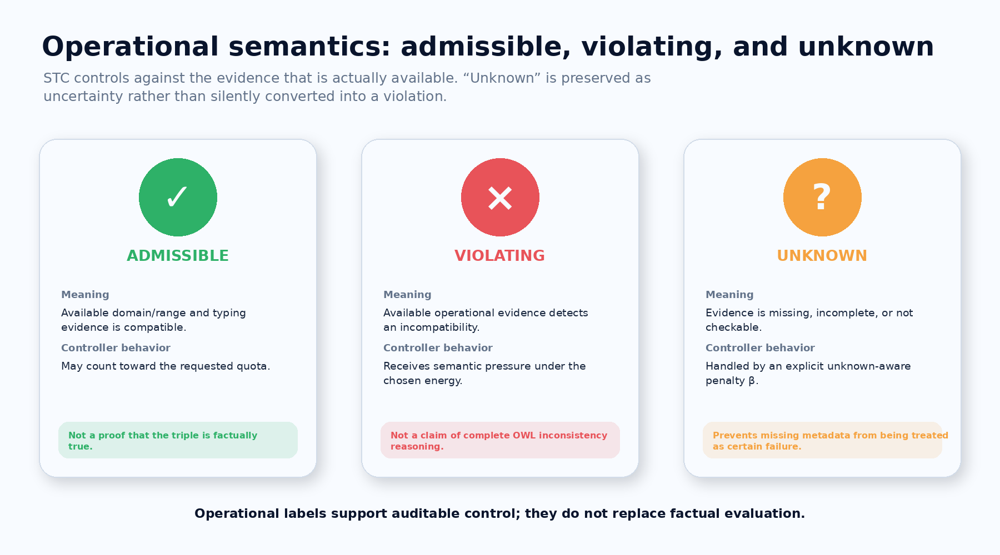
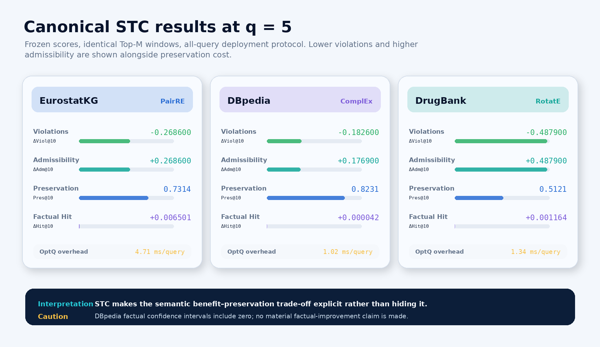

<p align="center">
  
</p>

<h1 align="center">STC: Inference-Time Semantic Target Control for Knowledge Graph Completion Rankings</h1>

<p align="center">
  <strong>Finite-window feasibility and minimum-pressure semantic quota control for frozen knowledge graph completion rankings.</strong>
</p>

<p align="center">
  <a href="paper/STC_ISWC_2026.pdf"></a>
  <a href="CITATION.cff"></a>
  <a href="docs/REPRODUCIBILITY.md"></a>
  <a href="https://www.python.org/"></a>
  
</p>

<p align="center">
  <a href="#overview">Overview</a> |
  <a href="#run-stc-in-thirty-seconds">Quick start</a> |
  <a href="#canonical-results">Results</a> |
  <a href="docs/FULL_REPRODUCTION.md">Full reproduction</a> |
  <a href="#citation">Citation</a>
</p>

---

## Overview

Knowledge graph completion systems are usually evaluated with held-out-fact
ranking metrics, while downstream users consume a short visible Top-k list.
That list can contain type- or relation-incompatible candidates even when
admissible alternatives are already present in the retrieved Top-M window.

**Semantic Target Control (STC)** is an inference-time controller for a frozen
KGC scorer. Given one materialized candidate window, operational semantic
evidence, visible size `k`, and requested quota `q`, STC:

1. certifies whether the finite window contains at least `q` admissible candidates;
2. separates retrieval infeasibility from correctable within-window selection failure;
3. computes the smallest query-specific scalar pressure required by the quota;
4. returns a deterministic Top-k list without retraining or re-querying.

<p align="center">
  
</p>

## Controller contract

| Property | STC behavior |
|---|---|
| Frozen upstream scorer | No retraining, fine-tuning, or score recalibration |
| Fixed candidate window | Control is restricted to an already materialized Top-M |
| Feasibility certificate | Infeasible queries expose a retrieval limitation |
| Query-specific pressure | The score margins and semantic composition determine `lambda*` |
| Minimum scalar pressure | Minimal within the controlled-score family `s'(c) = s(c) - lambda e(c)` |
| Deterministic ties | Controlled score, lower energy, frozen score, original order |
| Operational uncertainty | `unknown` means insufficient evidence, not a confirmed OWL violation |

## Run STC in thirty seconds

The bundled reference implementation has no runtime dependency:

```bash
python -m venv .venv
source .venv/bin/activate          # Linux/macOS
# .venv\Scripts\activate           # Windows PowerShell

python -m pip install --upgrade pip
python -m pip install -e .
python examples/toy_control.py
```

Expected certificate:

```text
feasible: True
lambda*: 0.050000
quota certificate: 3 admissible candidates in Top-5 (requested q=3)
```

The demonstration performs no training, download, re-query, reasoner call, or
external API request.

### Command-line interface

```bash
stc-control examples/toy_candidates.csv --top-k 5 --quota 3
stc-control examples/toy_candidates.csv --top-k 5 --quota 3 --json
```

## Visual explanation

### Minimum pressure, not arbitrary reordering

<p align="center">
  
</p>

### Feasibility before control

<p align="center">
  
</p>

### Operational semantic states

<p align="center">
  
</p>

## Canonical results

<p align="center">
  
</p>

| Dataset / scorer | Delta Viol@10 | Delta Adm@10 | Pres@10 | Delta Hit@10 | Delta MRR@10 | OptQ overhead |
|---|---:|---:|---:|---:|---:|---:|
| EurostatKG / PairRE | -0.2686 | +0.2686 | 0.7314 | +0.006501 | +0.001817 | 4.71 ms/query |
| DBpedia / ComplEx | -0.1826 | +0.1769 | 0.8231 | +0.000042 | +0.000004 | 1.02 ms/query |
| DrugBank / RotatE | -0.4879 | +0.4879 | 0.5121 | +0.001164 | +0.000206 | 1.34 ms/query |

Semantic admissibility and factual correctness are evaluated separately.
DBpedia factual confidence intervals include zero, so the paper makes no claim
of material factual improvement for that dataset.

## Reproduction paths

| Goal | Start here |
|---|---|
| Understand the controller | [`docs/QUICKSTART.md`](docs/QUICKSTART.md) |
| Rebuild datasets | [`docs/DATASETS.md`](docs/DATASETS.md) |
| Train a frozen scorer | [`docs/FULL_REPRODUCTION.md`](docs/FULL_REPRODUCTION.md) |
| Map experiment families | [`docs/EXPERIMENTS.md`](docs/EXPERIMENTS.md) |
| Inspect environment profiles | [`environment/README.md`](environment/README.md) |
| Verify artifact integrity | [`docs/REPRODUCIBILITY.md`](docs/REPRODUCIBILITY.md) |

## Repository layout

```text
semantic-target-control/
|-- src/stc/                lightweight OptQ reference implementation
|-- examples/               immediate CPU demonstration
|-- tests/                  deterministic controller tests
|-- scripts/
|   |-- preprocessing/      EurostatKG, DBpedia and DrugBank construction
|   |-- training/           PyKEEN, portfolio and DDP frozen scorers
|   `-- analysis/           publication-table post-processing
|-- commands/               portable PowerShell wrappers
|-- configs/                canonical and provenance configurations
|-- environment/            separated CPU, PyKEEN and DGL-KE profiles
|-- results/                frozen publication evidence and provenance
|-- paper/                  camera-ready paper and supplementary PDF
|-- assets/                 repository and explanatory graphics
|-- docs/                   detailed reproduction documentation
|-- tools/                  audit, manifest, packaging and release checks
|-- CITATION.cff
|-- LICENSE
`-- pyproject.toml
```

## Release status

This repository accompanies the final ISWC 2026 camera-ready paper and its
supplementary material. The v1.0.0 publication snapshot contains the validated
implementation, configurations, command wrappers, curated results,
reproducibility metadata, provenance records, and final publication PDFs.

- [Main camera-ready paper](paper/STC_ISWC_2026.pdf)
- [Supplementary material](paper/STC_ISWC_2026_supplementary.pdf)
- [Public large-artifact bundle](https://drive.google.com/drive/folders/1B0Qf5g6AZw3njeDmzzVVrdP8jOjIh8v-)

Detailed source-consistency, provenance, security, and release-readiness
reports are available under
[`results/provenance/release/`](results/provenance/release/).

## Data and distribution constraints

- **DrugBank:** the original XML dump is licensed and is not redistributed.
- **DBpedia:** preprocessing expects the 2016-10 ontology, English instance
  types, and English mapping-based object triples.
- **EurostatKG:** preprocessing code, metadata, provenance, and reconstruction
  guidance are included; raw source resources are not mirrored.
- Model checkpoints, complete Top-M windows, large entity maps, and full
  query-level outputs are intentionally excluded.

See [`DATA_STATEMENT.md`](DATA_STATEMENT.md) and
[`docs/DATASETS.md`](docs/DATASETS.md).

## Verification

```bash
python -m unittest discover -s tests -v
python examples/toy_control.py
python tools/check_local_imports.py
python tools/source_consistency_audit.py
python tools/release_readiness.py
python tools/repository_audit.py
python tools/verify_manifest.py
```

## Citation

GitHub exposes a **Cite this repository** action through
[`CITATION.cff`](CITATION.cff).

```bibtex
@inproceedings{skaperdas2026stc,
  title     = {STC: Inference-Time Semantic Target Control for Knowledge Graph Completion Rankings},
  author    = {Skaperdas, Efstratios and Bassiliades, Nick},
  booktitle = {The Semantic Web -- ISWC 2026},
  year      = {2026}
}
```

## Authors

- **Efstratios Skaperdas** - Aristotle University of Thessaloniki -
  [ORCID 0009-0004-6423-0240](https://orcid.org/0009-0004-6423-0240)
- **Nick Bassiliades** - Aristotle University of Thessaloniki -
  [ORCID 0000-0001-6035-1038](https://orcid.org/0000-0001-6035-1038)

## License

The software components are released under the
[Apache License 2.0](LICENSE). Dataset terms, paper copyright, and third-party
dependencies remain separate.

## Repository

- Source: https://github.com/sskaperdas/semantic-target-control
- Release tag: `v1.0.0-iswc2026`
